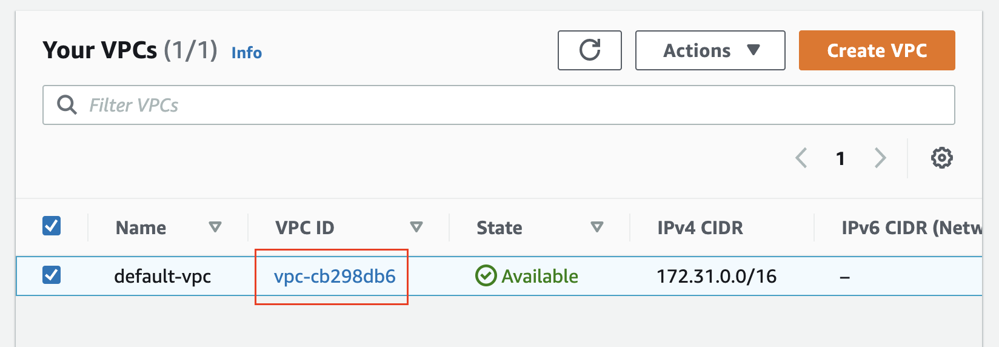
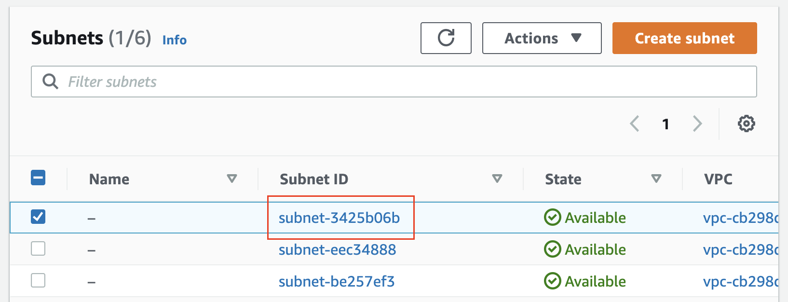

As you proceed through this course, we have added a few challenges to make your learning fun. Though the solutions are available for each challenge, we strongly encourage you to give your best shot while attempting them.

Now that you have created your first VPC to deploy servers, go ahead and try the following:

**Challenge 1 - Create an EC2 instance in a given VPC**
**Prerequisites**
1-You should have a VPC available in your account. Note the ID of a particular VPC, to use in your new template.
VPCs are specific to a region.  



2-You should have a public subnet available in the VPC selected above. Note down the subnet-ID.  


**ToDo**
Write a CloudFormation script that will create the following two Resources: AWS::EC2::SecurityGroup and AWS::EC2::Instance. See the snapshot below as a starter point.


Template with two resources: a SecurityGroup and an EC2 instance

You will have to write the suitable properties for each resource. Inside one of the properties' fields, you will have to specify the VPC and Subnet ID. Details of the resource to create are:

**1. AWS::EC2::SecurityGroup**
Creates a Security Group which only allows inbound access on TCP port 80 and also allows unrestricted outbound access. 
Refer to the [documentation](https://docs.aws.amazon.com/AWSCloudFormation/latest/UserGuide/aws-properties-ec2-security-group.html) to check which properties you want to use.

**2. AWS::EC2::Instance**
In the same CloudFormation script: create a resource that deploys an EC2 Server and associate its network interface with the security group mentioned above. Use the following properties:

* The instance type will be `t3.micro`.
* You will need the AMI ID of the base **Amazon Linux 2 AMI (HVM), SSD Volume Type**, on top of which we’ll install our web server software.  
 To get this ID, go to the EC2 web console and click on Launch Instance.  
 Since we’ll be launching a t3.micro instance, be sure to copy the AMI Id that says 64-bit x86 next to it.

>*Note that AMI IDs are specific to the region, and keep changing with patches and updates.*

See the snapshot below:  

Choose the AMI ID

* Your EC2 resource’s networking interface will need this property set to true: AssociatePublicIpAddress.  
  It ensures that your server gets assigned a public IP address that you can reach over the internet to verify it’s working correctly.
**Script to run**: We want a script to run automatically at the time of provisioning of the EC2 instance.  
 In the UserData section of this EC2 server, you will deploy the Apache Web Server software that we can then use to verify that the machine correctly deployed.  
 Use the following UserData script for your EC2 CloudFormation Resource:
 ```script
     UserData:
       Fn::Base64: !Sub |
         #!/bin/bash
         sudo yum update -y
         sudo yum install -y httpd
         sudo systemctl start httpd
         sudo systemctl enable httpd
```
The script above installs, and start the Apache Web Server in the new EC2 instance. Also, it will enable this service to start automatically after reboot.  
* **Bonus points**: Write your script to use parameters for the Subnet, VPC and AMI! This will make the script easier to maintain in the future and easier to move to other AWS Regions or accounts.
Refer to the [documentation](https://docs.aws.amazon.com/AWSCloudFormation/latest/UserGuide/aws-properties-ec2-instance.html) again to check which properties you want to use.


**Expected Output** 
To verify, you will use the public IP address of the newly launched EC2 instance, and paste it in a new browser window. You should see the Apache web server test page.
>*Note: Use http ( not https! ), like so: http://public-ip-address*  


Sample output at http://18.206.98.11/

**Solution**
Download the solution files, and run the command below:

```shell
aws cloudformation create-stack  --stack-name challenge1 --region us-east-1 --template-body file://challenge1.yml --parameters file://challenge1-parameters.json

```
Don't forget to change the VPC ID and Subnet ID as applicable to you.


**Supporting Materials**  
* [challenge1-parameters.json](./challenge1-parameters.json) 
* [Challenge1](./challenge1.yml) 


