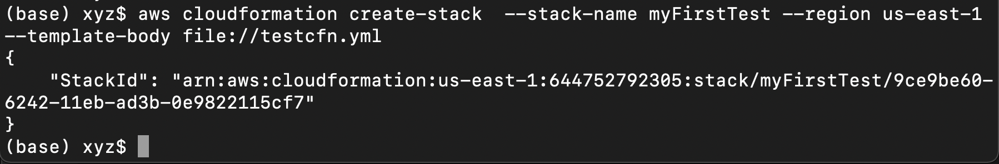
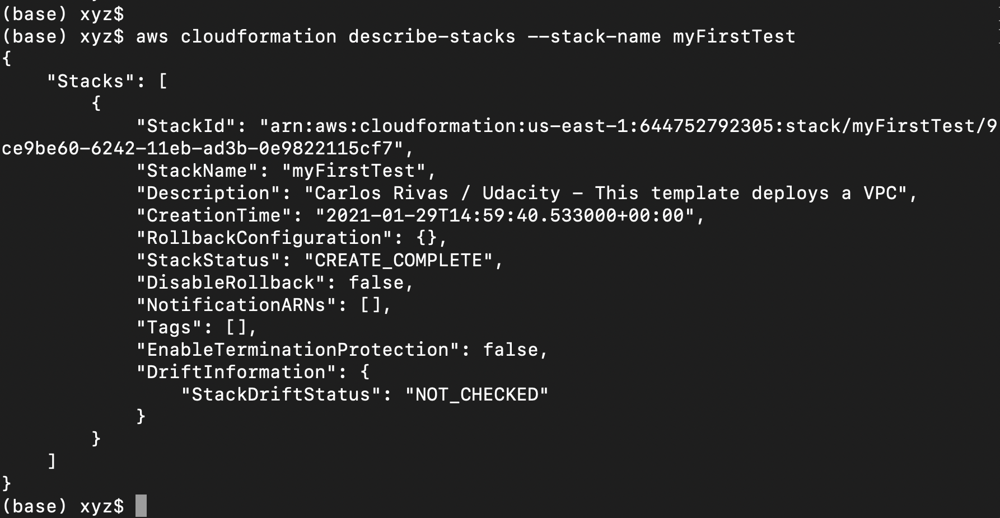

**Create stack** 
* **Create the template file**: 
Use the following code for your first test file: **[`testcfn.yml`](./testcfn.yml)** (or choose any other name). 
Be careful about the indentation while you paste/write the same code in your editor.
```yaml
AWSTemplateFormatVersion: 2010-09-09
Description: Carlos Rivas / Udacity - This template deploys a VPC
Resources:
UdacityVPC:
  Type: 'AWS::EC2::VPC'
  Properties:
    CidrBlock: 10.0.0.0/16
    EnableDnsHostnames: 'true'
    Tags:
    - Key: name
      Value: myfirsttestvpc
```
>*Do not copy-paste the template shown above because a YAML file is indentation-sensitive. Instead, write it on your own, or download it from the bottom of this page. 
>Right-click on the file name and select the "Save-as" option to download it locally in the right format*.

* **Run the aws command** : Run the following command in the terminal, from the same directory where you've placed your **[`testcfn.yml`](./testcfn.yml)** file.  
 We are assuming that your stack name is `myFirstTest` (or choose any other name).
```AWS CLI
aws cloudformation create-stack  --stack-name myFirstTest --region us-east-1 --template-body file://testcfn.yml
```
* **Alternate method - Shell Script**: You can write a **shell script** (.sh) file as:
```shell script
aws cloudformation create-stack --stack-name $1 --template-body file://$2  --parameters file://$3 --capabilities "CAPABILITY_IAM" "CAPABILITY_NAMED_IAM" --region=us-west-2
```
were `$1`, `$2`, and ``$3 can be replaced with the actual values passed as command-line arguments.  
Note the `--parameters` and `--capabilities` options that we will learn in the upcoming lesson.

* **Alternate method - Batch Script** You can also try a **batch script** (.bat) with a similar syntax, except that the actual values can be written as `%1` instead as`$1`.


Reference: The `create-stack` command has many options that you can refer to in the documentation [here](https://docs.aws.amazon.com/cli/latest/reference/cloudformation/create-stack.html).  

Output of the `create-stack` command

**Update stack** 
You may also want to use `update-stack` when you want to update an existing stack instead of destroying your stack and creating a new one.  
The syntax is similar to before: 
```AWS CLI
aws cloudformation update-stack  --stack-name myFirstTest --region us-east-1 --template-body file://testcfn.yml
```
The command above will update the existing stack based on the YAML script you've written.
Reference: `update-stack` [documentation](https://docs.aws.amazon.com/cli/latest/reference/cloudformation/update-stack.html).  
**Describe stack**
* Once a stack is created successfully, you can verify by either going to the web console or running the following command, which will display all the details the stack.
```AWS CLI
aws cloudformation describe-stacks --stack-name myFirstTest
```
* You can describe the details of multiple stacks in one command.  
* If no stack name is specified, then it will return the description for all the stacks created in your account.  
  
Output of the `describe-stacks` command.

>*Can you try [deleting the stack](https://docs.aws.amazon.com/cli/latest/reference/cloudformation/delete-stack.html#examples) yourself?*

* Reference: [describe-stacks documentation](https://docs.aws.amazon.com/cli/latest/reference/cloudformation/describe-stacks.html)
* [List of all possible](https://docs.aws.amazon.com/cli/latest/reference/cloudformation/index.html#cli-aws-cloudformation) `aws cloudformation` commands

**More about Templates**
* AWS documentation on [template basics](https://docs.aws.amazon.com/AWSCloudFormation/latest/UserGuide/gettingstarted.templatebasics.html)
**Supporting Materials**
* [Testcfn](./testcfn.yml)

