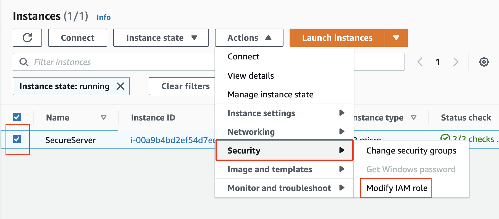

Previously, in this course, we have installed and configured the AWS CLI on our local computer to do our work. However, there’s an alternative.

**Brief Introduction**
You will create an EC2 Instance based on Amazon Linux AMI that you can connect via SSH. While provisioning the instance, you will make sure to limit access to your IP address only, using Security Groups. The instance will already have the CLI installed by default. You just need to assign permissions to this instance.

Once the instance is running, create an IAM role with admin access to your account. Then, attach the role to your EC2. In this case, the CLI tool will pick up the credentials from the role and won’t need hard-coded credentials.

Let's do this exercise to make your learning fun.

**Exercise objectives**
By the end of this exercise, you will be able to:

* Launch a secure EC2 instance
* Create IAM role with admin privileges
* Attach the IAM role to the EC2 instance created earlier
* Connect to your EC2 instance via SSH
* Use CLI tool in the EC2 instance  

**Step 1. Create a default VPC**
It is possible that you already have a default VPC created in your account.  
If not, go to the VPC dashboard and create a [default VPC](https://docs.aws.amazon.com/vpc/latest/userguide/default-vpc.html).

Ensure to have a [default VPC](https://docs.aws.amazon.com/vpc/latest/userguide/default-vpc.html)

**Step 2. Launch an EC2 instance**
* Navigate to the EC2 dashboard, and select the Instances services in the left-hand navigation pane.
* Use the Launch Instance wizard to launch an instance with the following configuration, and leave the remaining values as the defaults:
Stage	Configuration	Value
1.	Amazon Machine Image (AMI)	Amazon Linux 2 AMI (HVM), SSD Volume Type
Note: You have chosen a Free Tier Eligible AMI
2.	Instance Type	t2.micro
3.	Configure Instance Details	
a. Number of Instances	1
b. Network	Default
Select the VPC that was created in the previous step
c. Subnet	Default
4.	Storage	Default
5.	Tags	Optional
6.	Security Group	New.
Limit access to your IP address only
        See a snapshot below:

Allow only yourself to access the EC2 instance

* Download a new SSH Key if you don't have one already.
>**Important**: This key-pair will allow you to log into your instance, using SSH, from your local machine. Save the key-pair carefully, because the same private key cannot be re-generated.

Download the private key

* Verify that you should see the newly created EC2 instance in the Instances services. Check the instance state, it should say Running.

Running EC2 instance

**Step 3. Create an IAM Role**
Navigate to the IAM dashboard, and select the Roles services in the left-hand navigation pane.
Click on the Create role button, and provide the configuration details, as follows.

Launch the wizard to create a new IAM role

* Select AWS service as the type of trusted entity, and choose EC2 service to assume the new role. It will allow the EC2 instance, to whom we will attach this role later, to be able to call any AWS service on your behalf.

Select the AWS service as the trusted entity, and choose the EC2 service to assume the new role

* In the Filter policies textbox, search for the "admin" policy. Select the AdministratorAccess policy to apply to the new role.

Attach the admin policy to the new role

* Provide a name to the new role, such as VocareumSecureServerRole, or choose any other name of your choice.

Provide a role name

A successfully created role

**Step 4. Attach the Role to the EC2 Instance**
Go back to the EC2 dashboard, and view the list of the running instances.
Select the checkbox against the recently launched (earlier in this exercise) EC2 instance, and click the Actions button on the top of the list. It will open up drop-down options, select the Security → Modify IAM role option. See the snapshot below.

Modify IAM role

* On the next window, select and apply the newly created VocareumSecureServerRole to your instance.

Apply the new role to your EC2 instance

**Step 5. Connect to your EC2 instance**
Connect to your EC2 instance using SSH. Follow the instructions, as shown in the snapshot below.

Connect to your EC2 instance using an SSH client

* After connecting to your instance, verify the existing installation of AWS CLI, and run any AWS command, such as aws iam list-users.
Note: The AWS CLI tool will already be installed because we had chosen Amazon Linux AMI while provisioning. The CLI tool, in this case, will pick up the credentials from the role and won’t need hard-coded credentials

Connect to your instance, and run any AWS command

This is a convenient way to have a properly configured - and secure - server that you can use to test and not have to worry about credentials.
