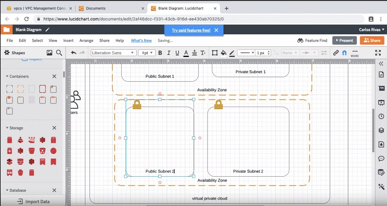

# Public vs Private Subnets

1-Drag 2 new `VPC_subnet` containers onto your canvas. 

  

2- Place one of the newly dragged `VPC_subnet` containers into each of your `Availability Zone` containers. 

   

3-Rename all of your `VPC_subnet` containers to match the following: 

  
