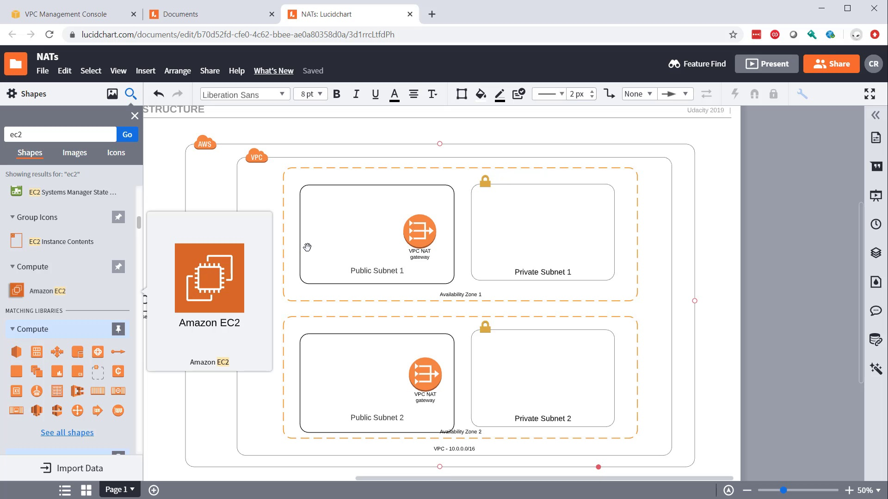
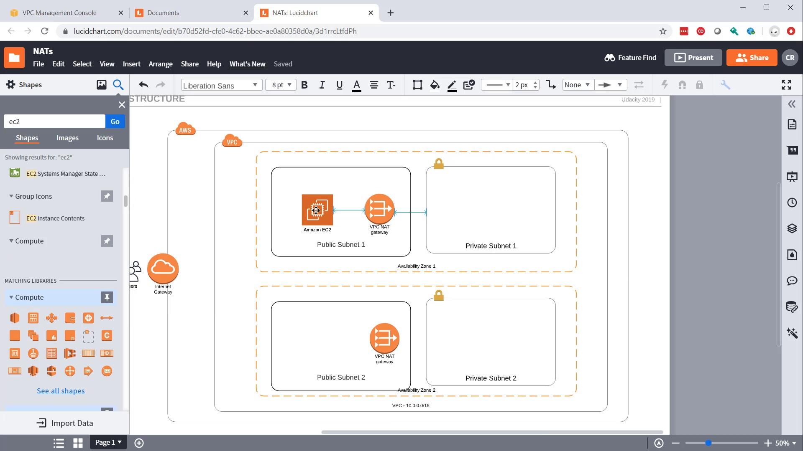
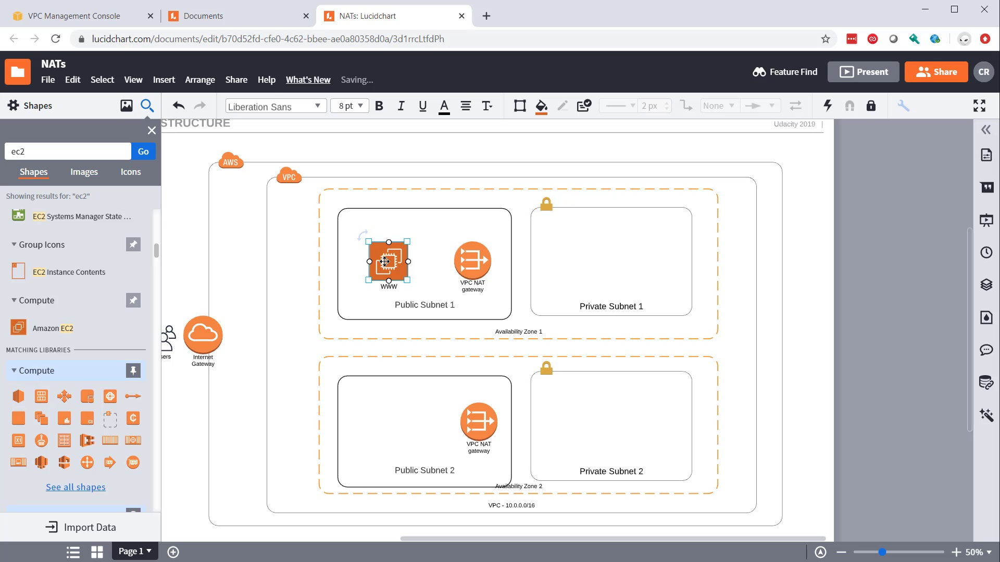
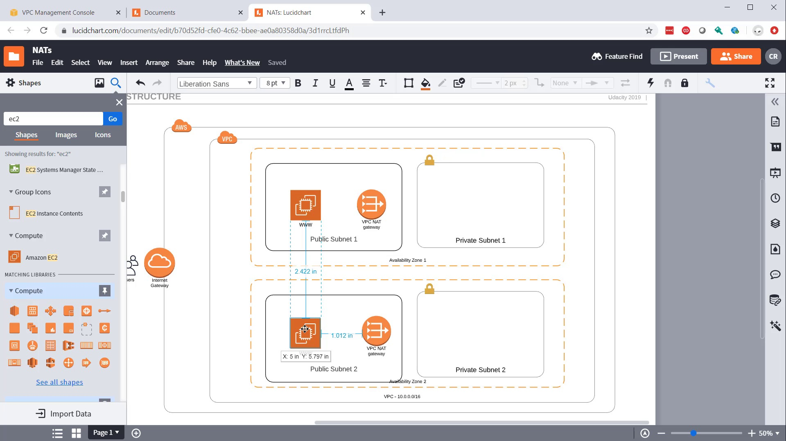
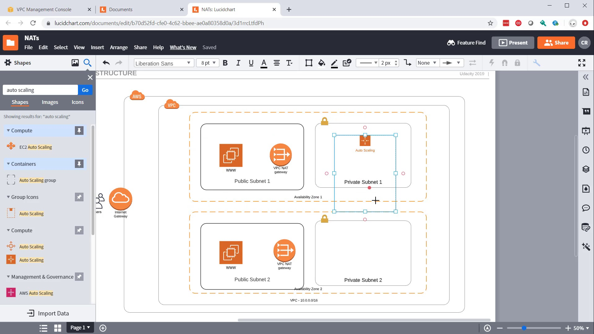

Search the shapes panel for `EC2` compute service.

2-Drag the `EC2` computer service onto your canvas and place it directly inside `Public Subnet 1`, to the left of your `VPC_NAT gateway`.

3-Rename the `EC2` compute service to `WWW`.

4-Duplicate your `EC2` compute service and place it inside `Public Subnet 2`.

5-Search the shapes panel for `Auto Scaling` and locate the one under `Group Icons`.

6-Drag the `Auto Scaling` group icon onto your canvas and place it inside `Private Subnet 1`.

7-Resize the `Auto Scaling` group icon so that it starts in `Private Subnet 1`, then extends and covers `Private Subnet 2`.

