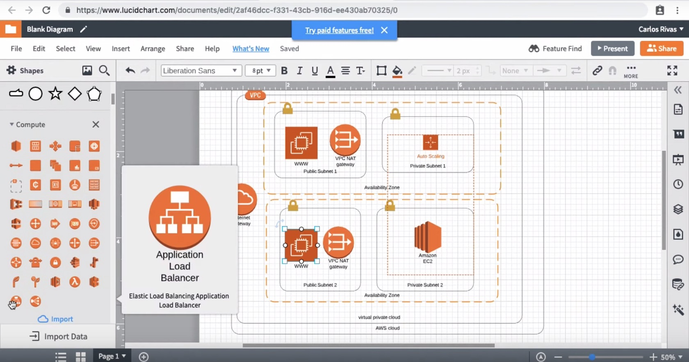
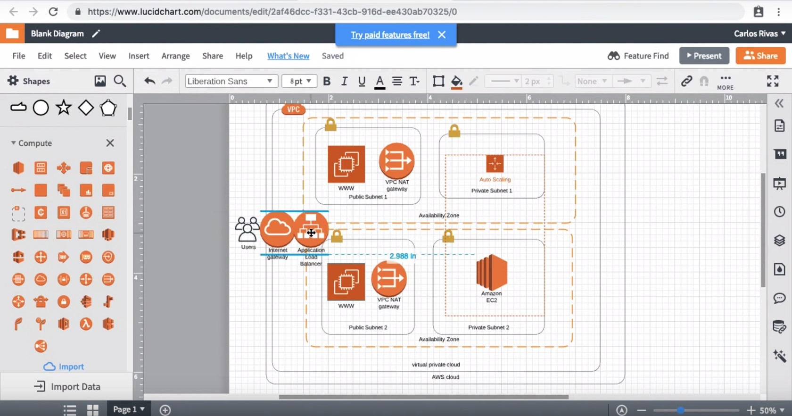

Important: Before this section we have taken the liberty of add the following to our diagram:

AutoScaling group in the Private Subnet 1.
An EC2 instance directly inside of Private Subnet 2. It is in addition to web servers (EC2 instances) in the public subnets.
Please take the time to add this to your diagram before continuing with this exercise.

1-Search shapes panel for Compute section and find the Application Load Balancer .

2-Drag the Application Load Balancer onto your canvas and place it on the right side of your Internet Gateway.

