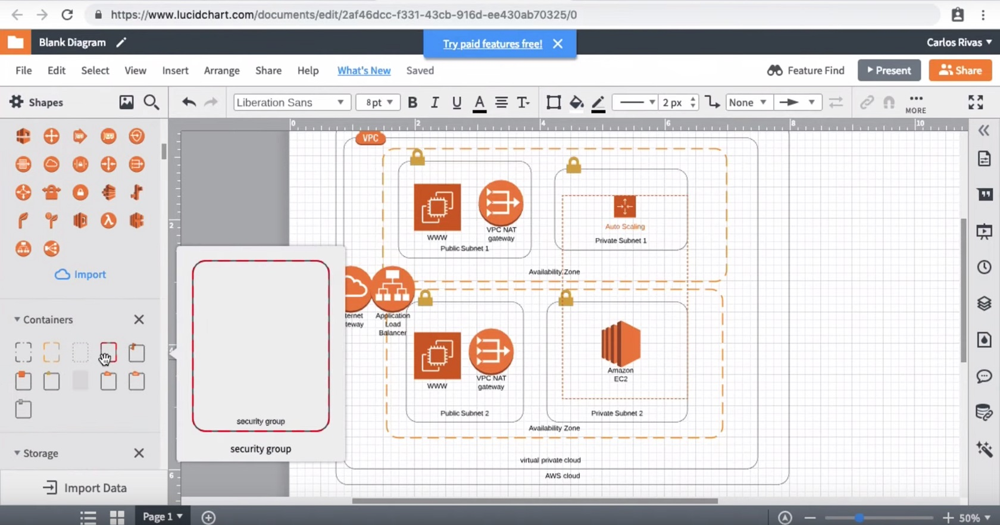
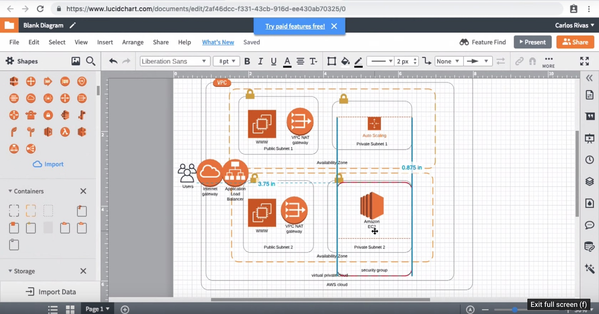
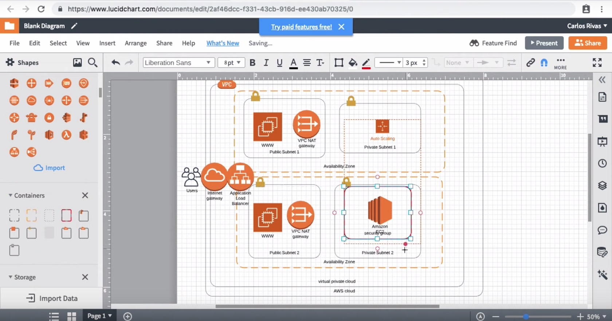

1-Search the shapes panel in the Containers section and locate the Security Group container .

2-Drag the Security Group container and place it on top of Private Subnet 2.

3-Resize the Security Group container so that it is only surrounding our EC2 Instance .

