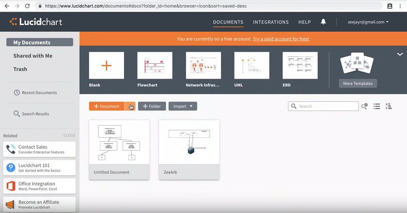
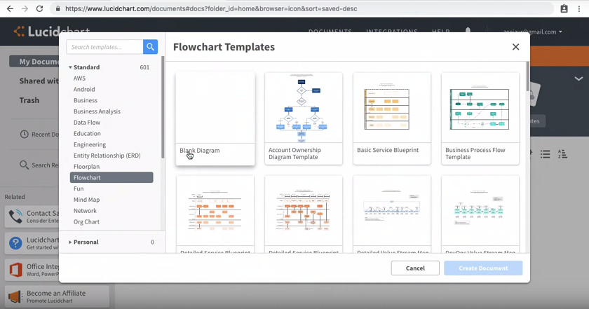
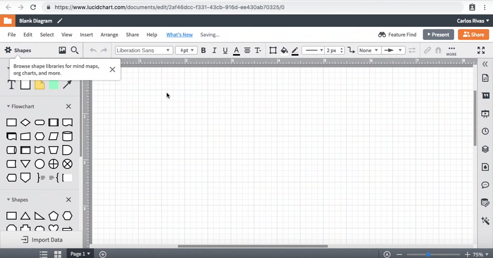
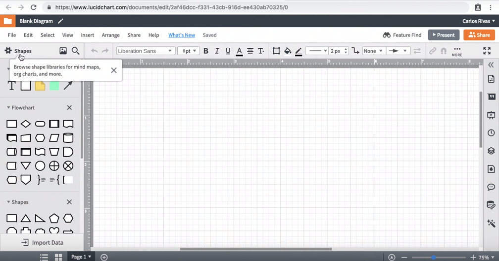
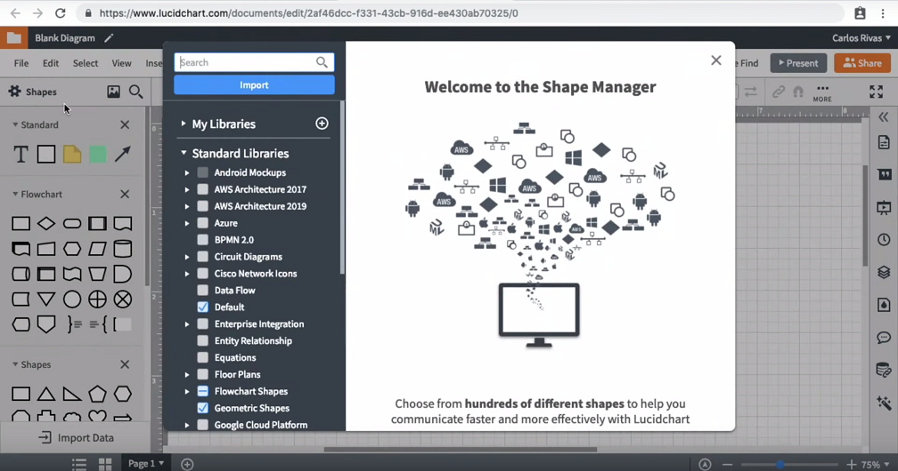
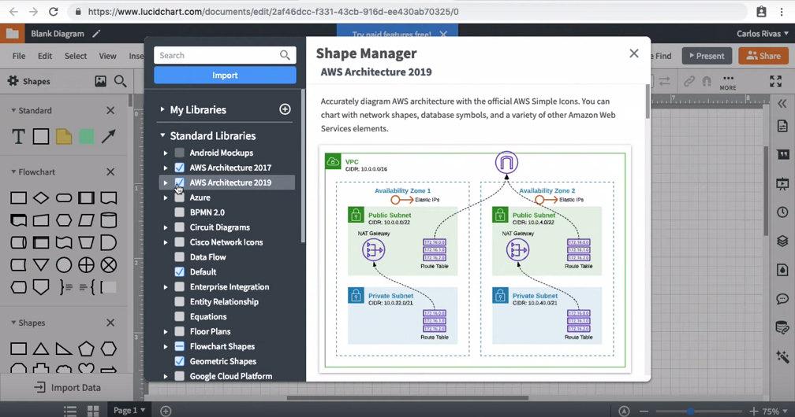

**Setting Up Lucid Charts**  
1-Open your browser and go navigate to https://www.lucidchart.com/  
  
2-Click the plus icon to create a new Document  
  
3-Click on `Blank Diagram` to select a blank template.  
  
* You should now have a blank Document that looks like this:  
  
4-Click on the Shapes button in the top left of the control panel to access the Shape Manager screen  
  
  
  
5-Select both `AWS Architecture 2017` & `AWS Architecture 2019` and then **Click** the `X` icon in the top right hand corner.  
  
