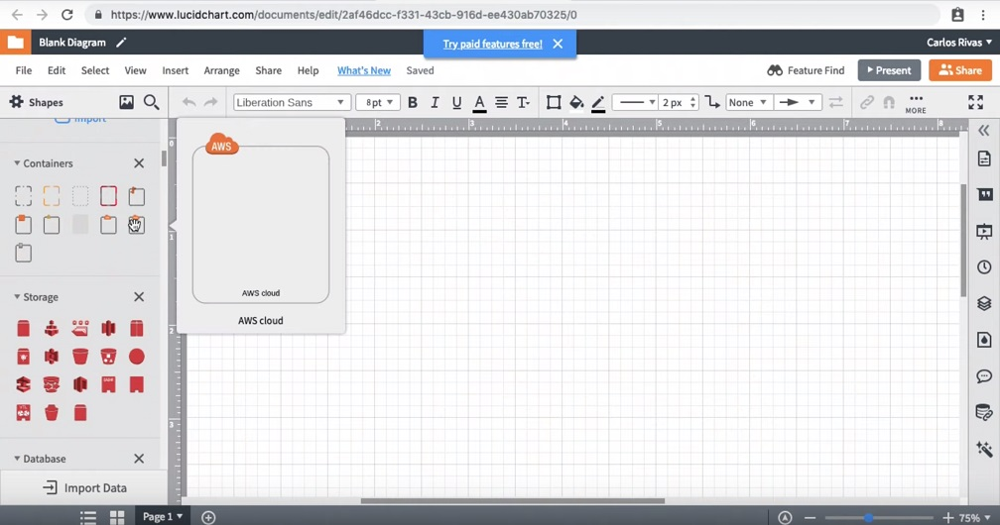
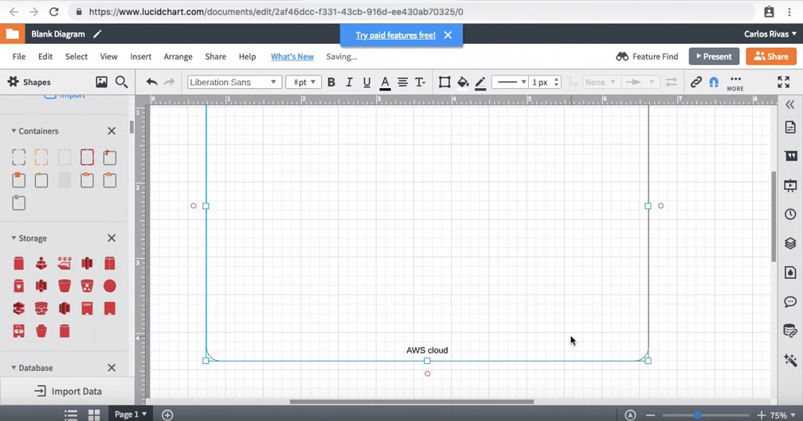
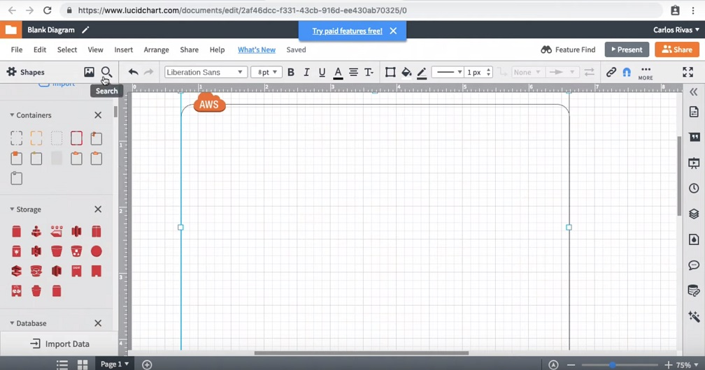
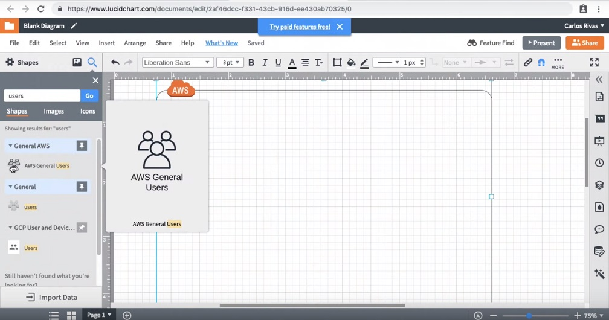
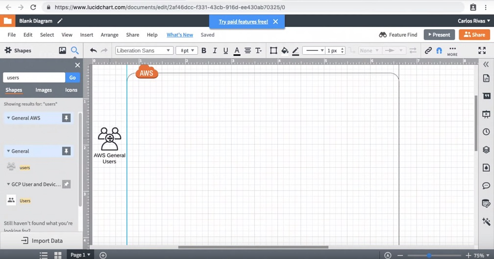
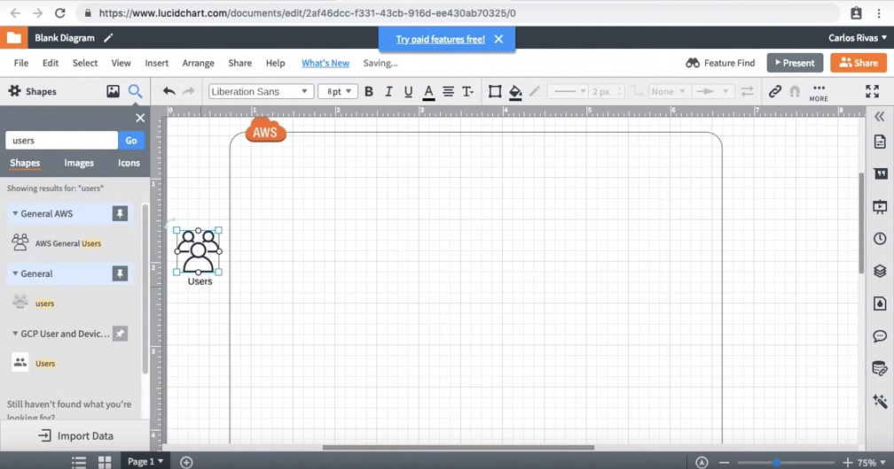

**Diagramming AWS accounts & regions**  

1-From the `Shapes` panel. Scroll down to the `Containers` and drag `AWS cloud` container onto your canvas.
 
 

2-Stretch your `AWS cloud` container to give yourself more room by dragging its corners.
  

3-Search for `users` and locate `AWS General Users`

  

4-Drag the `AWS General Users` onto your canvas.
  

5-Rename your `AWS General` `Users` shape to Users.

