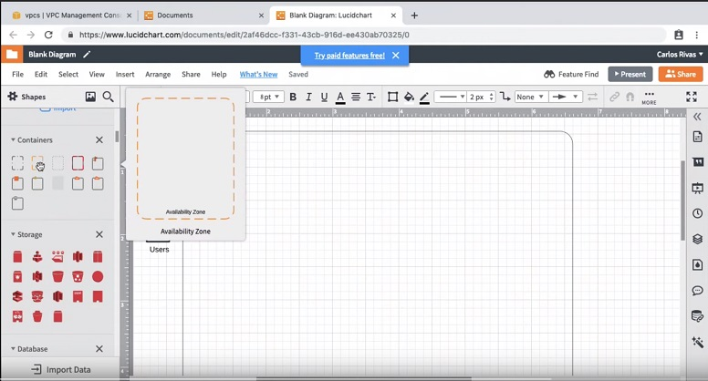
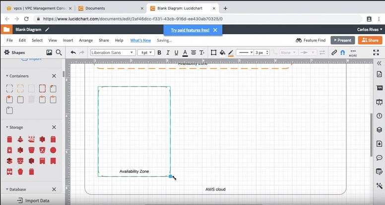

1-Locate the `Availability Zone` shape from the `Containers` section.  

2-Drag the `Availability Zone` shape inside of your existing `AWS cloud` container.
  

3-Expand your `Availability Zone`'s width within the `AWS cloud` container.
   

4-Add another `Availability Zone` container below your existing `Availability Zone` container by repeating the initial 3 steps.
   

* Your final result should look like this:
   
