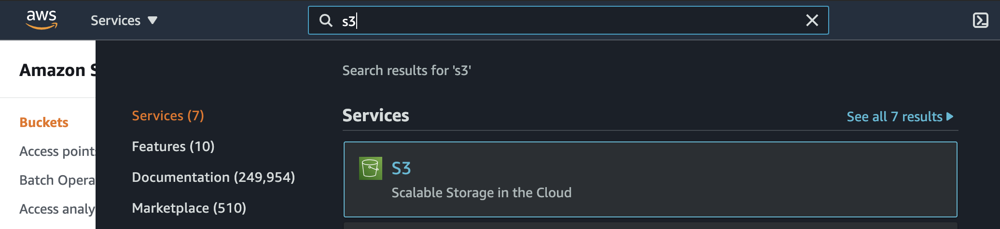
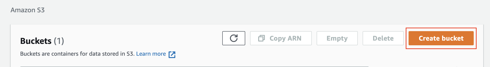
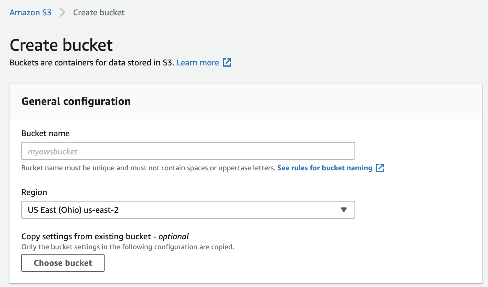
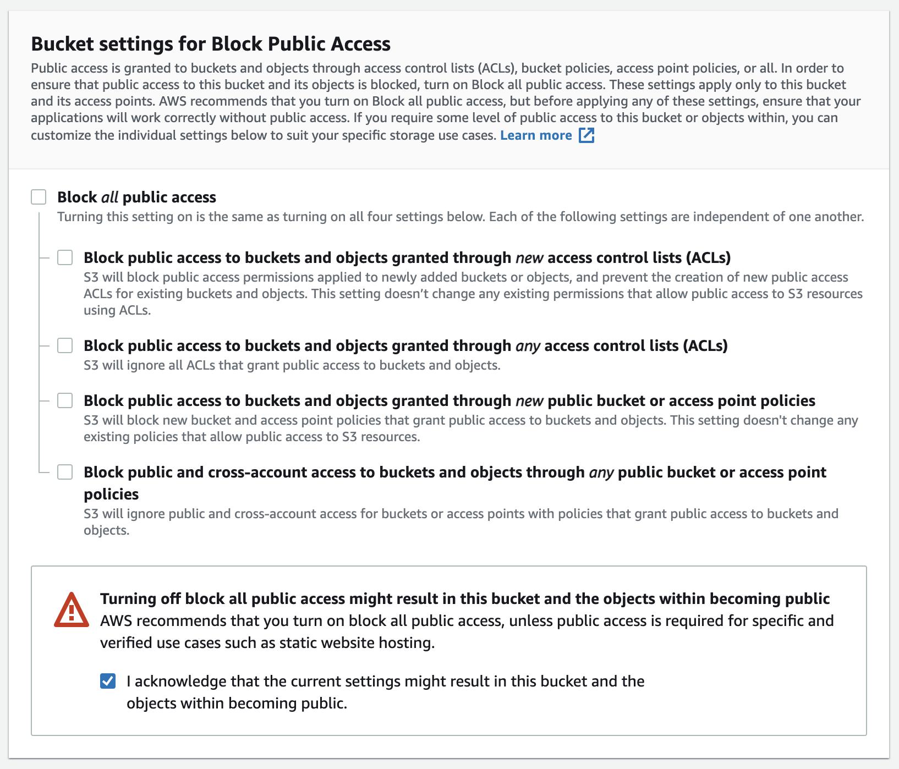
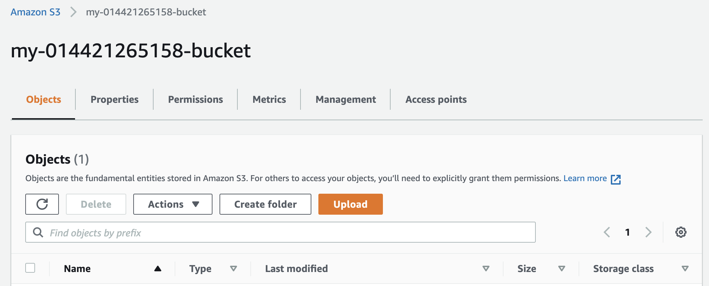

# 2- Create S3 Bucket
1- Navigate to the “AWS Management Console” page, type “S3” in the “Find Services” box and then select “S3”.

  Navigate to the S3 service
  
2- The Amazon S3 dashboard displays. Click “Create bucket”.

 
   Create a bucket

3- In the **General configuration**, enter a “Bucket name” and a region of your choice. Note: Bucket names must be globally unique.

   One of the convenient naming conventions is `my-123456789-bucket`, where you can replace `123456789` with your 12 digit AWS account ID.

4- In the **Bucket settings for Block Public Access** section, uncheck the “Block all public access”. It will enable the public access to the bucket objects via the S3 object URL.

**Note** - We are allowing the public access to the bucket contents because we are going to host a static website in this bucket. 
**Hosting requires the content should be publicly readable.**

 Allow the public access to the bucket contents

5- Click “Next” and click “Create bucket”.

6- Once the bucket is created, click on the name of the bucket to open the bucket to the contents.
 
Bucket `my-014421265158-bucket` configuration and content
