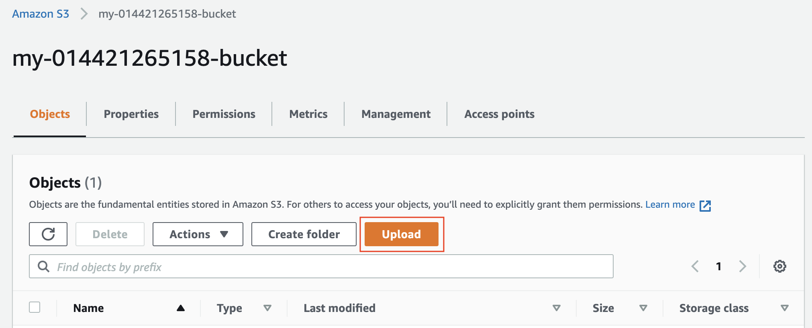

# 3- Upload files to S3 Bucket
1- Once the bucket is open to its contents, click the “Upload” button.

 *Click on the **Upload** button*

2- Click the "Add files" and “Add folder” button, and upload the Student-ready starter code folder content from your local computer to the S3 bucket.

 
*Click "Add files" to upload the `index.html` file, and click "Add folder" to upload the `css`, `img`, and `vendor` folders.*

 
Do not select the `udacity-starter-website` folder. Instead, upload its content one-by-one.

 
*Successfully uploaded starter code in the bucket*

