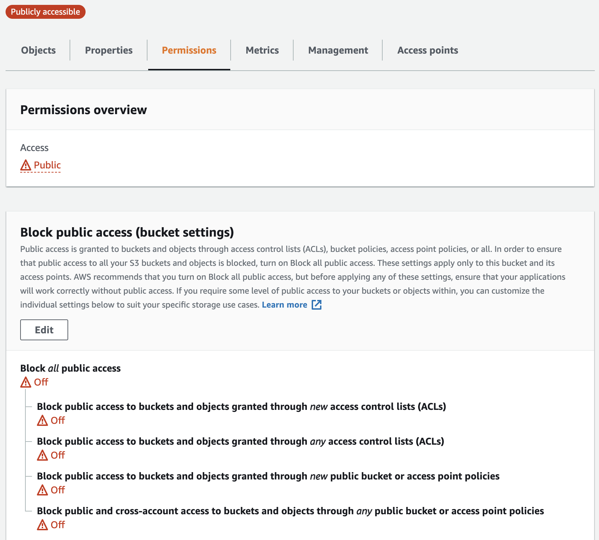

# 4- Secure Bucket via IAM
1- Click on the “Permissions” tab.
 
 *Go to the **Permissions** tab. See that the bucket allows public access for hosting.*

2- The “Bucket Policy” section shows it is empty. Click on the Edit button.
*Empty bucket policy. Check this policy again after setting up the CloudFront distribution.*


3- Enter the following bucket policy replacing `your-website` with the name of your bucket and click “Save”.

```
{
"Version":"2012-10-17",
"Statement":[
 {
   "Sid":"AddPerm",
   "Effect":"Allow",
   "Principal": "*",
   "Action":["s3:GetObject"],
   "Resource":["arn:aws:s3:::your-website/*"]
 }
]
}
```
You will see warnings about making your bucket public, but **this step is required for static website hosting.**


**Note** - If we were not learning about static website hosting, we could have made the bucket private and wouldn't have to specify any bucket access policy explicitly. 
In such a case, once we set up the ***CloudFront distribution***, it will automatically update the current bucket access policy to access the bucket content. 

The CloudFront service will make this happen by using the **Origin Access Identity** user.
