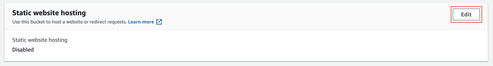
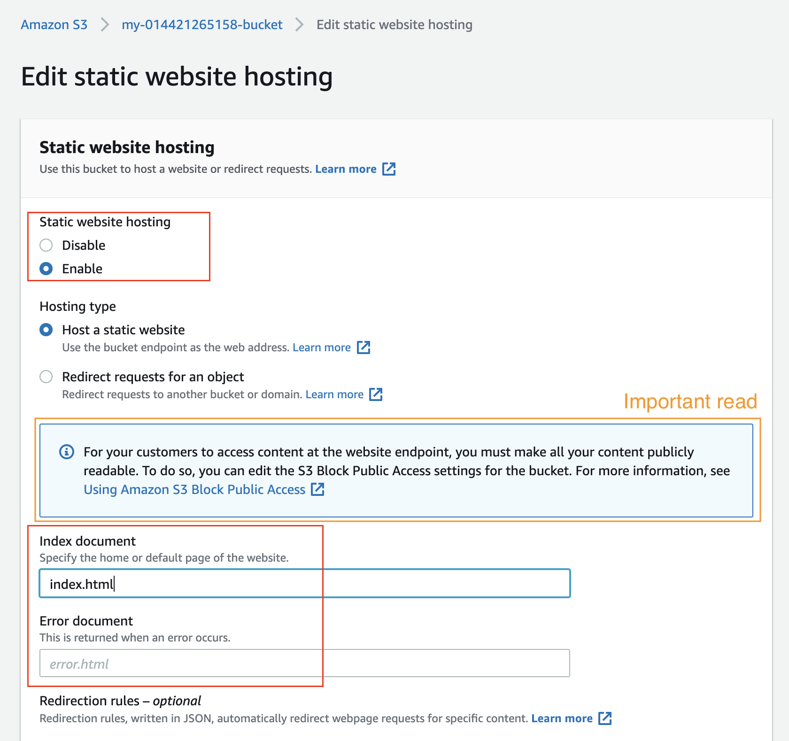
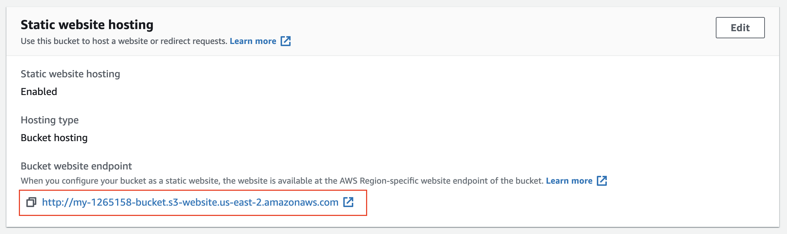

# 5- Configure S3 Bucket
1- Go to the **Properties** tab and then scroll down to edit the **Static website hosting** section.

*Go to the **Properties** tab*

*Edit the **Static website hosting** section*

2- Click on the “Edit” button to see the **Edit static website hosting** screen. Now, enable the **Static website hosting**, and provide the default home page and error page for your website.

*Enable the static website hosting, and provide the home page and error page.*

>> *Did you notice that enabling the static website hosting requires you to make your bucket public?*
>> 
>> *In the snapshot above, it says "For your customers to access the content at the website endpoint, you must make all your content **publicly readable**."*

3- For both “Index document” and “Error document”, enter “index.html” and click “Save”. 
After successfully saving the settings, check the **Static website hosting sectio**n again under the **Properties** tab. 
You must now be able to view the [website endpoint](https://docs.aws.amazon.com/AmazonS3/latest/dev/WebsiteEndpoints.html) as shown below:

*Copy the website endpoint for future use.*

