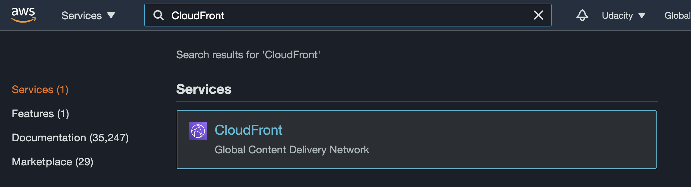
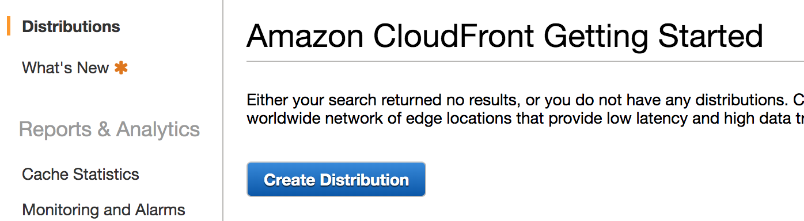
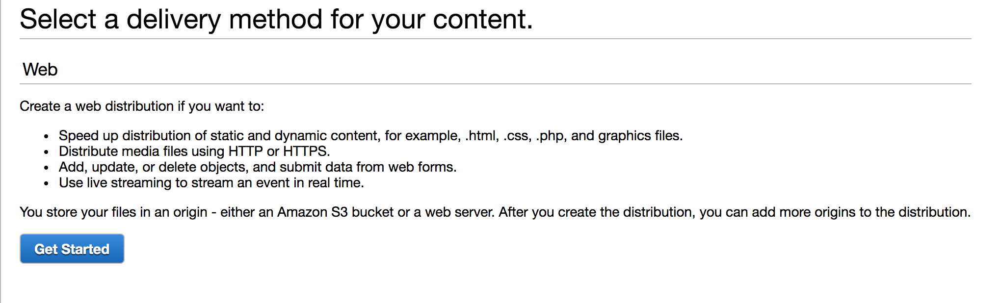
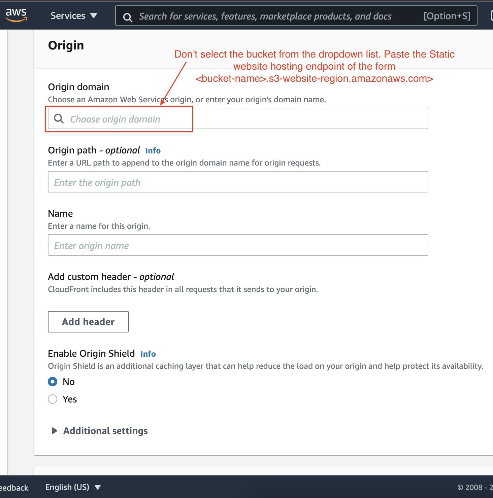
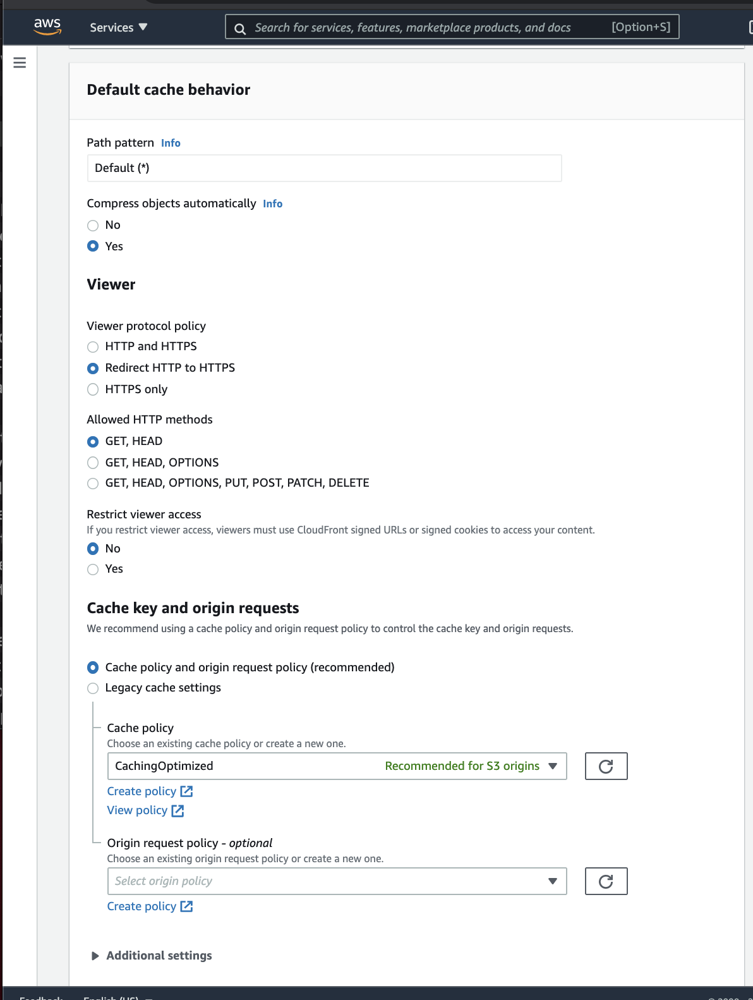

# 6- Distribute Website via CloudFront
1- Select “Services” from the top left corner and enter “cloud front” in the “Find a service by name or feature” text box and select “CloudFront”.

2- From the CloudFront dashboard, click “Create Distribution”.

3- For “Select a delivery method for your content”, click “Get Started”.

4- Use the following details to create a distribution:
|Field	|Value|
|:------ |:------|
|Origin > Domain Name	|Don't select the bucket from the dropdown list. Paste the Static website hosting endpoint of the form  <bucket-name>.s3-website-region.amazonaws.com`|
|Origin > Enable Origin Shield|	No|
|Default cache behavior|	Use default settings|	
|Cache key and origin requests|	Use default settings|

  
*Configurations - Origin details*

*Configurations - Cache behavior, key and origin requests*
Configurations - Cache behavior, key and origin requests

5- Leave the defaults for the rest of the options, and click “Create Distribution”. 
  It may take up to 10 minutes for the CloudFront Distribution to get created.
**Note**: It may take up to 10 minutes for the CloudFront Distribution to be created.

6- Once the status of your distribution changes from “In Progress” to “Deployed”, copy the endpoint URL for your CloudFront distribution found in the “Domain Name” column.
>> **Note** - Remember, as soon as your CloudFront distribution is **Deployed**, it attaches to S3 and starts caching the S3 pages. 
>> CloudFront may take 10-30 minutes (or more) to cache the S3 page. Once the caching is complete, the CloudFront domain name URL will stop redirecting to the S3 object URL.

In this example, the Domain Name value is `dgf7z6g067r6d.cloudfront.net`, but ***yours will be different***.

