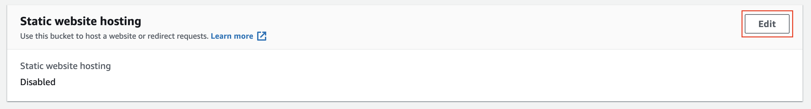
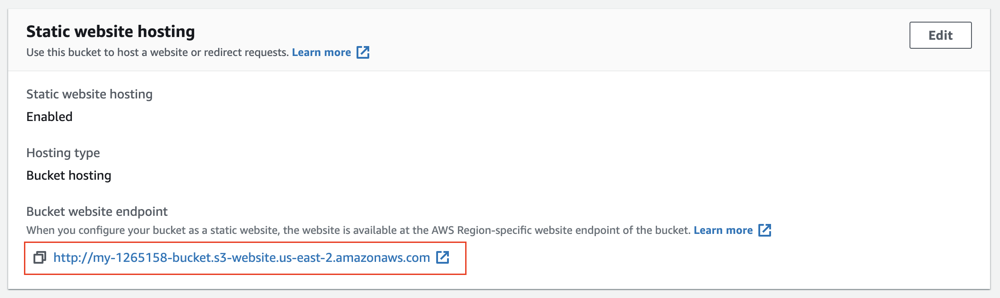
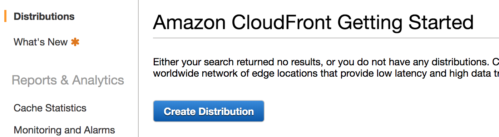
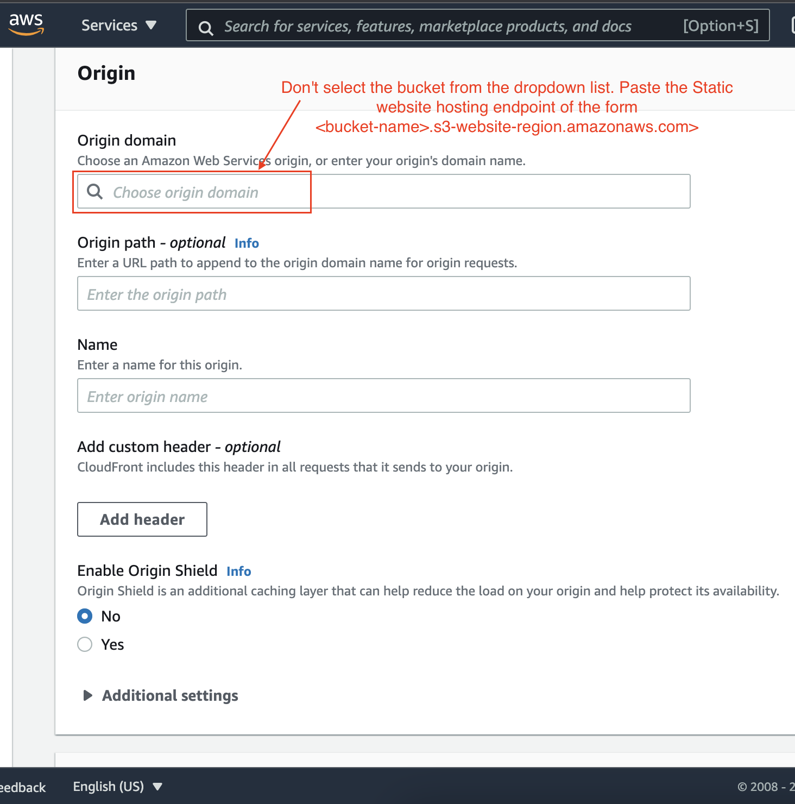

# [ ↩ ](https://github.com/mohamedelfal/UdacityAdvancedCloudDevOps/)

# PROJECT 1
## Deploy Static Website on AWS

# TABLE OF CONTENTS
* [1- Introduction](#1--Introduction-)
  * [Project Overview](#project-overview-)
  * [Prerequisites](#prerequisites-)
  * [Dependencies](#dependencies-)
* [2- Create S3 Bucket](#2--create-s3-bucket-)
* [3- Upload Files To S3 Bucket](#3--upload-files-to-s3-bucket-)
* [4- Secure Bucket Via IAM](#4--secure-bucket-via-iam-)
* [5- Configure S3 Bucket](#5--configure-s3-bucket-)
* [6- Distribute Website Via Cloudfront](#6--distribute-website-via-cloudfront-)
* [Files](#files-)


# 1- Introduction [🔝](#project-1)

In this project, you will deploy a static website to AWS.

## Project Overview [🔝](#project-1)
The cloud is perfect for hosting static websites that only include HTML, CSS, and JavaScript files that require no server-side processing. The whole project has two major intentions to implement:

* Hosting a static website on S3 and
* Accessing the cached website pages using CloudFront content delivery network (CDN) service. Recall that CloudFront offers low latency and high transfer speeds during website rendering.

*Note that Static website hosting essentially requires a public bucket, whereas the CloudFront can work with public and private buckets.*

In this project, you will deploy a static website to AWS by performing the following steps:

* You will create a public S3 bucket and upload the website files to your bucket.
* You will configure the bucket for website hosting and secure it using IAM policies.
* You will speed up content delivery using AWS’s content distribution network service, CloudFront.
* You will access your website in a browser using the unique CloudFront endpoint.


## Prerequisites: [🔝](#project-1)
* AWS Account
* [Student-ready starter code](https://drive.google.com/open?id=15vQ7-utH7wBJzdAX3eDmO9ls35J5_sEQ) - Download and unzip this file.
## Topics Covered: [🔝](#project-1)
* S3 bucket creation
* S3 bucket configuration
* Website distribution via CloudFront
* Access website via web browser
## Dependencies [🔝](#project-1)
Cloud Services
* Amazon Web Services S3 - Resource hosting and deployments
* AWS CloudFront - CDN for SPA
* AWS EKS - Backend API
* AWS DynamoDB - Persistent Datastore
* AWS Cognito - User Authentication
Performance Tracking and DevOps Tools:
* AWS CloudWatch - Performance and Health checks
  * Sentry - Bug Reporting
  * Alternates:
  * TBD
* Google Analytics - Usage Reporting
  * Alternates:
  * Mixpanel
* Travis (CI/CD)
Frameworks:
* Ionic (Javascript) (Frontend)
* Node.js (Javascript) (Backend)


# 2- Create S3 Bucket [🔝](#project-1)
1- Navigate to the “AWS Management Console” page, type “S3” in the “Find Services” box and then select “S3”.

  Navigate to the S3 service
  
2- The Amazon S3 dashboard displays. Click “Create bucket”.

 
   Create a bucket

3- In the **General configuration**, enter a “Bucket name” and a region of your choice. Note: Bucket names must be globally unique.

   One of the convenient naming conventions is `my-123456789-bucket`, where you can replace `123456789` with your 12 digit AWS account ID.


4- In the **Bucket settings for Block Public Access** section, uncheck the “Block all public access”. It will enable the public access to the bucket objects via the S3 object URL.

**Note** - We are allowing the public access to the bucket contents because we are going to host a static website in this bucket. 
**Hosting requires the content should be publicly readable.**


 Allow the public access to the bucket contents

5- Click “Next” and click “Create bucket”.

6- Once the bucket is created, click on the name of the bucket to open the bucket to the contents.
 
Bucket `my-014421265158-bucket` configuration and content

# 3- Upload files to S3 Bucket [🔝](#project-1)
1- Once the bucket is open to its contents, click the “Upload” button.

 *Click on the **Upload** button*

2- Click the "Add files" and “Add folder” button, and upload the Student-ready starter code folder content from your local computer to the S3 bucket.

 
*Click "Add files" to upload the `index.html` file, and click "Add folder" to upload the `css`, `img`, and `vendor` folders.*

 
Do not select the `udacity-starter-website` folder. Instead, upload its content one-by-one.

 
*Successfully uploaded starter code in the bucket*

# 4- Secure Bucket via IAM [🔝](#project-1)
1- Click on the “Permissions” tab.
 
 *Go to the **Permissions** tab. See that the bucket allows public access for hosting.*

2- The “Bucket Policy” section shows it is empty. Click on the Edit button.
*Empty bucket policy. Check this policy again after setting up the CloudFront distribution.*


3- Enter the following bucket policy replacing `your-website` with the name of your bucket and click “Save”.

```
{
"Version":"2012-10-17",
"Statement":[
 {
   "Sid":"AddPerm",
   "Effect":"Allow",
   "Principal": "*",
   "Action":["s3:GetObject"],
   "Resource":["arn:aws:s3:::your-website/*"]
 }
]
}
```
You will see warnings about making your bucket public, but **this step is required for static website hosting.**


**Note** - If we were not learning about static website hosting, we could have made the bucket private and wouldn't have to specify any bucket access policy explicitly. 
In such a case, once we set up the ***CloudFront distribution***, it will automatically update the current bucket access policy to access the bucket content. 

The CloudFront service will make this happen by using the **Origin Access Identity** user.

# 5- Configure S3 Bucket [🔝](#project-1)
1- Go to the **Properties** tab and then scroll down to edit the **Static website hosting** section.

*Go to the **Properties** tab*


*Edit the **Static website hosting** section*

2- Click on the “Edit” button to see the **Edit static website hosting** screen. Now, enable the **Static website hosting**, and provide the default home page and error page for your website.

*Enable the static website hosting, and provide the home page and error page.*

>> *Did you notice that enabling the static website hosting requires you to make your bucket public?*
>> 
>> *In the snapshot above, it says "For your customers to access the content at the website endpoint, you must make all your content **publicly readable**."*

3- For both “Index document” and “Error document”, enter “index.html” and click “Save”. 
After successfully saving the settings, check the **Static website hosting sectio**n again under the **Properties** tab. 
You must now be able to view the [website endpoint](https://docs.aws.amazon.com/AmazonS3/latest/dev/WebsiteEndpoints.html) as shown below:

*Copy the website endpoint for future use.*


# 6- Distribute Website via CloudFront [🔝](#project-1)
1- Select “Services” from the top left corner and enter “cloud front” in the “Find a service by name or feature” text box and select “CloudFront”.


2- From the CloudFront dashboard, click “Create Distribution”.


3- For “Select a delivery method for your content”, click “Get Started”.


4- Use the following details to create a distribution:
|Field	|Value|
|:------ |:------|
|Origin > Domain Name	|Don't select the bucket from the dropdown list. Paste the Static website hosting endpoint of the form  <bucket-name>.s3-website-region.amazonaws.com`|
|Origin > Enable Origin Shield|	No|
|Default cache behavior|	Use default settings|	
|Cache key and origin requests|	Use default settings|

  
*Configurations - Origin details*


*Configurations - Cache behavior, key and origin requests*
Configurations - Cache behavior, key and origin requests

5- Leave the defaults for the rest of the options, and click “Create Distribution”. 
  It may take up to 10 minutes for the CloudFront Distribution to get created.
  
**Note**: It may take up to **10 minutes** for the CloudFront Distribution to be created.

6- Once the status of your distribution changes from “In Progress” to “Deployed”, copy the endpoint URL for your CloudFront distribution found in the “Domain Name” column.
>> **Note** - Remember, as soon as your CloudFront distribution is **Deployed**, it attaches to S3 and starts caching the S3 pages. 
>> CloudFront may take 10-30 minutes (or more) to cache the S3 page. Once the caching is complete, the CloudFront domain name URL will stop redirecting to the S3 object URL.


In this example, the Domain Name value is `dgf7z6g067r6d.cloudfront.net`, but ***yours will be different***.


# Files [🔝](#project-1)
  * [Udacity Starter Website](./udacity-starter-website.zip)
  * [README.md](./README.md)
    * [1-Introduction.md](./1-Introduction.md)
    * [2-CreateS3Bucket.md](./2-CreateS3Bucket.md)
    * [3-UploadFilesToS3Bucket.md](./3-UploadFilesToS3Bucket.md)
    * [4-SecureBucketViaIAM.md](./4-SecureBucketViaIAM.md)
    * [5-ConfigureS3Bucket.md](./5-ConfigureS3Bucket.md)
    * [6-DistributeWebsiteViaCloudFront.md](./6-DistributeWebsiteViaCloudFront.md)


# [🔝](#project-1)

# [ ↩ ](https://github.com/mohamedelfal/UdacityAdvancedCloudDevOps/)
