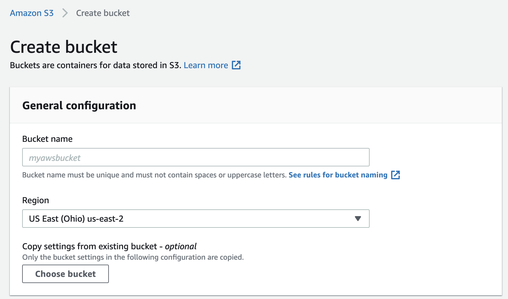

# PROJECT 1
## Deploy Static Website on AWS

# 1- Introduction

In this project, you will deploy a static website to AWS.

## Project Overview
The cloud is perfect for hosting static websites that only include HTML, CSS, and JavaScript files that require no server-side processing. The whole project has two major intentions to implement:

* Hosting a static website on S3 and
* Accessing the cached website pages using CloudFront content delivery network (CDN) service. Recall that CloudFront offers low latency and high transfer speeds during website rendering.

*Note that Static website hosting essentially requires a public bucket, whereas the CloudFront can work with public and private buckets.*

In this project, you will deploy a static website to AWS by performing the following steps:

* You will create a public S3 bucket and upload the website files to your bucket.
* You will configure the bucket for website hosting and secure it using IAM policies.
* You will speed up content delivery using AWS’s content distribution network service, CloudFront.
* You will access your website in a browser using the unique CloudFront endpoint.

## Prerequisites:
* AWS Account
* [Student-ready starter code](https://drive.google.com/open?id=15vQ7-utH7wBJzdAX3eDmO9ls35J5_sEQ) - Download and unzip this file.
## Topics Covered:
* S3 bucket creation
* S3 bucket configuration
* Website distribution via CloudFront
* Access website via web browser
## Dependencies
Cloud Services
* Amazon Web Services S3 - Resource hosting and deployments
* AWS CloudFront - CDN for SPA
* AWS EKS - Backend API
* AWS DynamoDB - Persistent Datastore
* AWS Cognito - User Authentication
Performance Tracking and DevOps Tools:
* AWS CloudWatch - Performance and Health checks
  * Sentry - Bug Reporting
  * Alternates:
  * TBD
* Google Analytics - Usage Reporting
  * Alternates:
  * Mixpanel
* Travis (CI/CD)
Frameworks:
* Ionic (Javascript) (Frontend)
* Node.js (Javascript) (Backend)


# 2- Create S3 Bucket
1- Navigate to the “AWS Management Console” page, type “S3” in the “Find Services” box and then select “S3”.

  Navigate to the S3 service
  
2- The Amazon S3 dashboard displays. Click “Create bucket”.

 
   Create a bucket

3- In the **General configuration**, enter a “Bucket name” and a region of your choice. Note: Bucket names must be globally unique.

   One of the convenient naming conventions is `my-123456789-bucket`, where you can replace `123456789` with your 12 digit AWS account ID.


4- In the **Bucket settings for Block Public Access** section, uncheck the “Block all public access”. It will enable the public access to the bucket objects via the S3 object URL.

**Note** - We are allowing the public access to the bucket contents because we are going to host a static website in this bucket. 
**Hosting requires the content should be publicly readable.**


 Allow the public access to the bucket contents

5- Click “Next” and click “Create bucket”.

6- Once the bucket is created, click on the name of the bucket to open the bucket to the contents.
 
Bucket `my-014421265158-bucket` configuration and content

# 3- Upload files to S3 Bucket
1- Once the bucket is open to its contents, click the “Upload” button.

 *Click on the **Upload** button*

2- Click the "Add files" and “Add folder” button, and upload the Student-ready starter code folder content from your local computer to the S3 bucket.

 
*Click "Add files" to upload the `index.html` file, and click "Add folder" to upload the `css`, `img`, and `vendor` folders.*

 
Do not select the `udacity-starter-website` folder. Instead, upload its content one-by-one.

 
*Successfully uploaded starter code in the bucket*

# 4- Secure Bucket via IAM
1- Click on the “Permissions” tab.
 
 *Go to the **Permissions** tab. See that the bucket allows public access for hosting.*

2- The “Bucket Policy” section shows it is empty. Click on the Edit button.
*Empty bucket policy. Check this policy again after setting up the CloudFront distribution.*


3- Enter the following bucket policy replacing `your-website` with the name of your bucket and click “Save”.

```
{
"Version":"2012-10-17",
"Statement":[
 {
   "Sid":"AddPerm",
   "Effect":"Allow",
   "Principal": "*",
   "Action":["s3:GetObject"],
   "Resource":["arn:aws:s3:::your-website/*"]
 }
]
}
```
You will see warnings about making your bucket public, but **this step is required for static website hosting.**


**Note** - If we were not learning about static website hosting, we could have made the bucket private and wouldn't have to specify any bucket access policy explicitly. 
In such a case, once we set up the ***CloudFront distribution***, it will automatically update the current bucket access policy to access the bucket content. 

The CloudFront service will make this happen by using the **Origin Access Identity** user.
