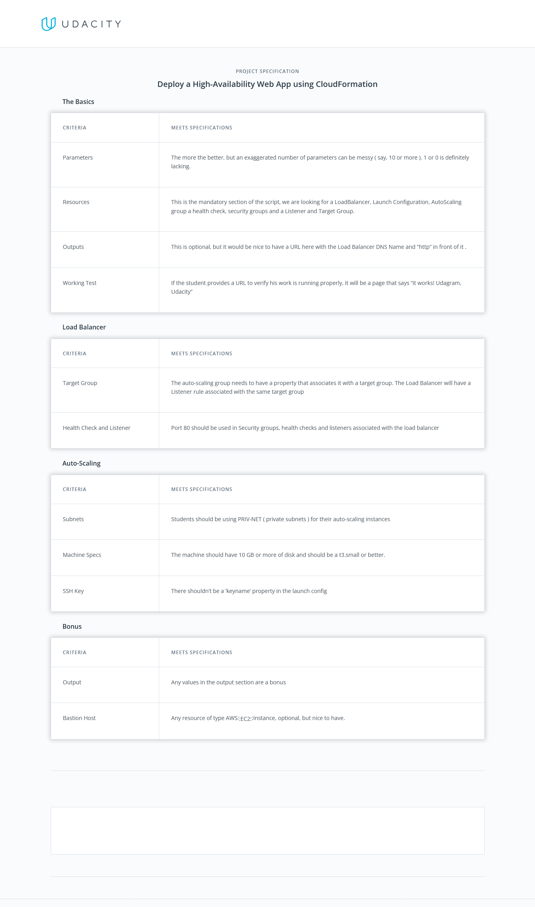

# [ ↩ ](https://github.com/mohamedelfal/UdacityAdvancedCloudDevOps/)
 # Udacity Advanced Cloud DevOps

# project 2: Deploy a high-availability web app using CloudFormation

## Table of Contents
>* [1-Project Introduction](#1-project-introduction-)
>> * [Starter Code](#starter-code)
>* [2-Problem](#2-problem-)
>> * [Scenario](#scenario)
>* [3-Project Requirements](#3-project-requirements-)
>> * [Server Specs](#server-specs)
>* [4-Other Considerations](#4-other-considerations-)
>> * [Other Considerations](#other-considerations)
>* [project 2 rubric ](#project-2-rubric-)

# project 2: Deploy a high-availability web app using CloudFormation
In this project, you’ll deploy web servers for a highly available web app using CloudFormation.

# 1-Project Introduction [🔝](#project-2)
As your final project, you'll be faced with a real scenario.

Creating this project will give you the hands-on experience you need to confidently talk about infrastructure as code. We have chosen a realistic scenario where you will deploy a dummy application (a sample JavaScript or HTML file) to the Apache Web Server running on an EC2 instance.

There will be two parts to this project:

* **Diagram**: You'll first develop a diagram that you can present as part of your portfolio and as a visual aid to understand the CloudFormation script.

* **Script (Template and Parameters)**: The second part is to interpret the instructions and create a matching CloudFormation script.

## Starter Code

You will find starter code for the project in this [Github repository](https://github.com/udacity/nd9991-c2-Infrastructure-as-Code-v1).  
The same repo has the resources used in the lesson demos/exercises for a quick reference.

 

# 2-Problem [🔝](#project-2)

## Scenario

Your company is creating an Instagram clone called Udagram.

Developers want to deploy a new application to the AWS infrastructure.

You have been tasked with provisioning the required infrastructure and deploying a **dummy application**, along with the necessary supporting software.

This needs to be automated so that the infrastructure can be discarded as soon as the testing team finishes their tests and gathers their results.

**Optional** - To add more challenge to the project, once the project is completed, you can try deploying sample website files located in a public S3 Bucket to the Apache Web Server running on an EC2 instance. 

Though, it is not the part of the project rubric.

# 3-Project Requirements [🔝](#project-2)

## Server specs

You'll need to create a Launch Configuration for your application servers in order to deploy four servers, two located in each of your private subnets. The launch configuration will be used by an auto-scaling group.

You'll need two vCPUs and at least 4GB of RAM. The Operating System to be used is Ubuntu 18. So, choose an Instance size and Machine Image (AMI) that best fits this spec.

Be sure to allocate at least 10GB of disk space so that you don't run into issues. 

Security Groups and Roles

* 1-Since you will be downloading the application archive from an **S3 Bucket**, you'll need to create an **IAM Role** that allows your instances to use the S3 Service.

* 2-Udagram communicates on the default `HTTP Port: 80`, so your servers will need this inbound port open since you will use it with the **Load Balancer**  and the **Load Balancer Health Check** . 
As for outbound, the servers will need unrestricted internet access to be able to download and update their software.

* 3-The load balancer should allow all public traffic `(0.0.0.0/0)` on `port 80` inbound, which is the default `HTTP port`. 
Outbound, it will only be using `port 80` to reach the internal servers.

* 4-The application needs to be deployed into private subnets with a **Load Balancer** located in a public subnet.

* 5-One of the output exports of the **CloudFormation** script should be the public URL of the **LoadBalancer. Bonus points** if you add `http://` in front of the load balancer `DNS Name` in the output, for convenience.

# 4-Other Considerations [🔝](#project-2)

## Other Considerations

* 1- You can deploy your servers with an **`SSH Key`** into Public subnets while you are creating the script. 
 This helps with troubleshooting. Once done, move them to your private subnets and remove the **`SSH Key`** from your **`Launch Configuration`**.

* 2- It also helps to test directly, without the load balancer. Once you are confident that your server is behaving correctly, increase the instance count and add the load balancer to your script.

* 3- While your instances are in public subnets, you'll also need the **`SSH port open (port 22)`** for your access, in case you need to troubleshoot your instances.

* 4- Log information for UserData scripts is located in this file: **`cloud-init-output.log`** under the folder: **`/var/log`**.

* 5- You should be able to destroy the entire infrastructure and build it back up without any manual steps required, other than running the **CloudFormation** script.

* 6- The provided UserData script should help you install all the required dependencies. 
Bear in mind that this process takes several minutes to complete. Also, the application takes a few seconds to load. 
This information is crucial for the settings of your load balancer health check.

* 7- It's up to you to decide which values should be parameters and which you will hard-code in your script.

* 8- See the provided supporting code for help and more clues.

* 9- If you want to go the extra mile, set up a bastion host (jump box) to allow you to SSH into your private subnet servers. 
This bastion host would be on a Public Subnet with **`port 22`** open only to your home **`IP address`**, and it would need to have the private key that you use to access the other servers.

***Last thing***: Remember to **delete your CloudFormation stack** when you're done to avoid recurring charges!

# 5- Project Submission
## Deploy a high-availability web app using CloudFormation

In this project, you’ll deploy web servers for a highly available web app using CloudFormation.   
You will write the code that creates and deploys the infrastructure and application for an Instagram-like app from the ground up.   
You will begin with deploying the networking components, followed by servers, security roles and software. The procedure you follow here will become part of your portfolio of cloud projects.   
You’ll do it exactly as it’s done on the job - following best practices and scripting as much as possible.

Gather your files and submit them via a zipped folder or a GitHub link.

Be sure you have completed all of the project requirements.

Also, check your work against the [rubric](#project-2-rubric-) [here](./image/Project2Rubric.png) before submitting!

## [Project 2 Rubric ](./image/Project2Rubric.png)

# [ ↩ ](https://github.com/mohamedelfal/UdacityAdvancedCloudDevOps/) [🔝](#project-2)
